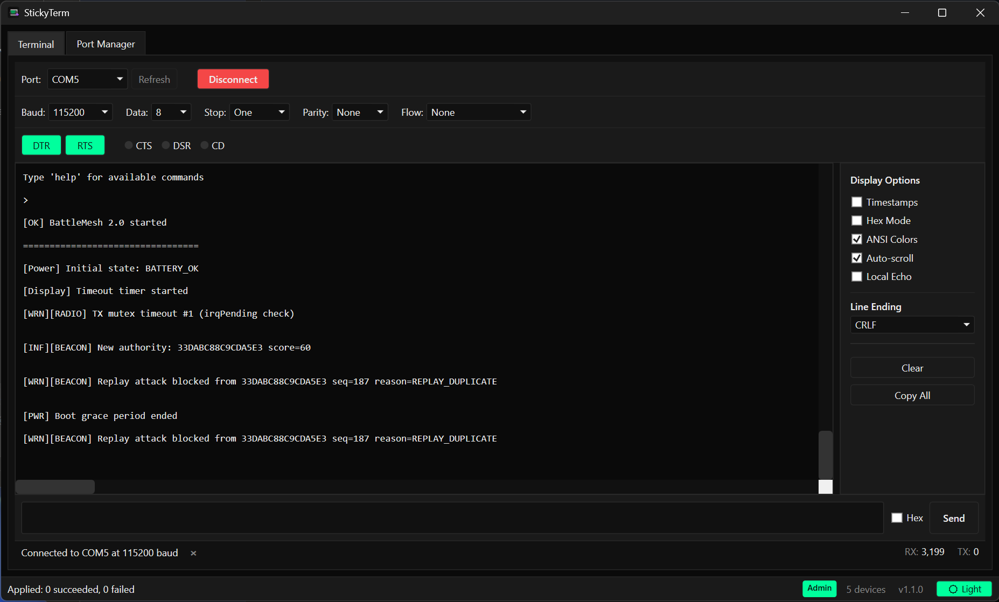
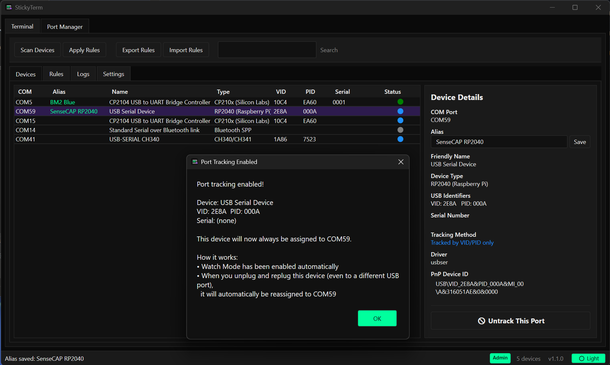

<p align="center">
  
</p>

<h1 align="center">StickyTerm</h1>

<p align="center">
  Serial terminal with sticky COM port assignments for USB serial devices.
</p>

<p align="center">
  <a href="https://github.com/ril3y/StickyTerm/actions/workflows/build.yml"></a>
  <a href="https://github.com/ril3y/StickyTerm/releases/latest"></a>
  <a href="https://github.com/ril3y/StickyTerm/stargazers"></a>
  <a href="https://github.com/ril3y/StickyTerm/blob/main/LICENSE"></a>
  <a href="https://battlewithbytes.io/projects/stickyterm"></a>
</p>

---

Ever plug in a USB serial device and find it's jumped to a different COM port? StickyTerm keeps your USB serial devices on consistent COM ports by binding device identities (VID/PID/Serial) to preferred port numbers, applying them automatically via registry writes. It also has a built-in serial terminal so you can talk to your devices without leaving the app.

## Screenshots

### Serial Terminal
Full-featured terminal with ANSI color support, hex mode, DTR/RTS control, and CTS/DSR/CD status indicators.



### Device Discovery & Port Tracking
Discover all COM port devices, view detailed identity info, and one-click track a device to keep it on its current port.



### REST API & Settings
Optional HTTP API for AI coding assistants and external tools to query port information. System tray, startup, and theme settings.


## Features

### Built-in Serial Terminal
- Configurable baud rate, data bits, stop bits, parity, and flow control
- ANSI color code rendering
- Command history (up/down arrow keys)
- Hex mode for sending/receiving raw bytes
- DTR/RTS control line toggles with CTS/DSR/CD status LEDs

### Device Discovery
- Auto-discovers all COM port devices: USB CDC, USB-UART bridges, Bluetooth SPP, etc.
- Shows VID, PID, USB serial number, instance path, friendly name, and driver
- Detects chip families: FTDI, CP210x, CH340/CH341, Prolific, RP2040, STM32 CDC, Arduino
- Stability indicator: green (has serial number) vs orange (unstable/no serial)
- Custom device aliases for friendly naming

### Sticky Port Assignments
- One-click **Track This Port** to lock a device to its current COM port
- Create rules to bind devices to specific COM port numbers
- Match types: VID+PID+Serial, VID+PID, Instance ID, Friendly Name
- Priority-based rule matching when multiple rules apply
- Watch mode: rules apply automatically when devices are plugged in

### REST API
- Optional HTTP API on configurable port (default 27182)
- `GET /api/ports` - connected ports with aliases
- `GET /api/devices` - all known devices
- `GET /api/rules` - configured rules
- `GET /api/status` - server health
- Useful for AI coding assistants (Cursor, Claude Code, etc.) to discover serial devices

### More
- System tray with minimize-to-tray
- Auto-start with Windows via Task Scheduler
- Dark and light themes
- Import/export rules for backup or sharing
- Daily log files with configurable retention

## Download

Grab the latest release from the [Releases](https://github.com/ril3y/StickyTerm/releases) page.

The zip contains a self-contained executable - no .NET runtime installation required.

## Requirements

- Windows 10 or Windows 11
- Administrator privileges (required for COM port registry modifications)

## Building from Source

```bash
# Clone
git clone https://github.com/ril3y/StickyTerm.git
cd StickyTerm

# Build
dotnet build StickyTerm.sln

# Run (requires admin)
dotnet run --project StickyTerm/StickyTerm.csproj

# Run tests
dotnet test StickyTerm.Tests/StickyTerm.Tests.csproj

# Publish self-contained executable
dotnet publish StickyTerm/StickyTerm.csproj -c Release -r win-x64 --self-contained -o publish
```

## Usage

1. **Launch** - StickyTerm scans for devices automatically on startup
2. **Terminal** - Select a port, configure baud rate, click **Connect**
3. **Track** - In Port Manager, select a device and click **Track This Port**
4. **Watch** - Rules are applied automatically whenever a tracked device is plugged in
5. **API** - Enable the HTTP API in Settings for external tool integration

## Project Structure

```
StickyTerm/              Main WPF application
  Models/                Data models (ComDevice, PortRule, AppSettings, etc.)
  Services/              Business logic (WMI discovery, registry, rule engine)
  ViewModels/            MVVM view models
  Views/                 XAML views and dialogs
  Converters/            WPF value converters
  Themes/                Dark and light theme resources
  Api/                   REST API response models
  Helpers/               Utility classes
StickyTerm.Tests/        xUnit test project
Installer/               Inno Setup installer script
StickyTerm.Package/      MSIX packaging project
```

## How It Works

StickyTerm modifies the Windows registry key `HKLM\SYSTEM\CurrentControlSet\Enum\<DeviceID>\Device Parameters\PortName` to reassign COM port numbers. When a tracked device is plugged in, the watch service detects the device arrival via WMI, matches it against your rules, and writes the preferred port number. A device restart (disable/enable cycle) is performed automatically so the new port takes effect without replugging.

## Contributing

Contributions are welcome. Please open an issue first to discuss what you'd like to change.

## License

[MIT](LICENSE) - Copyright (c) 2025 Riley Porter
